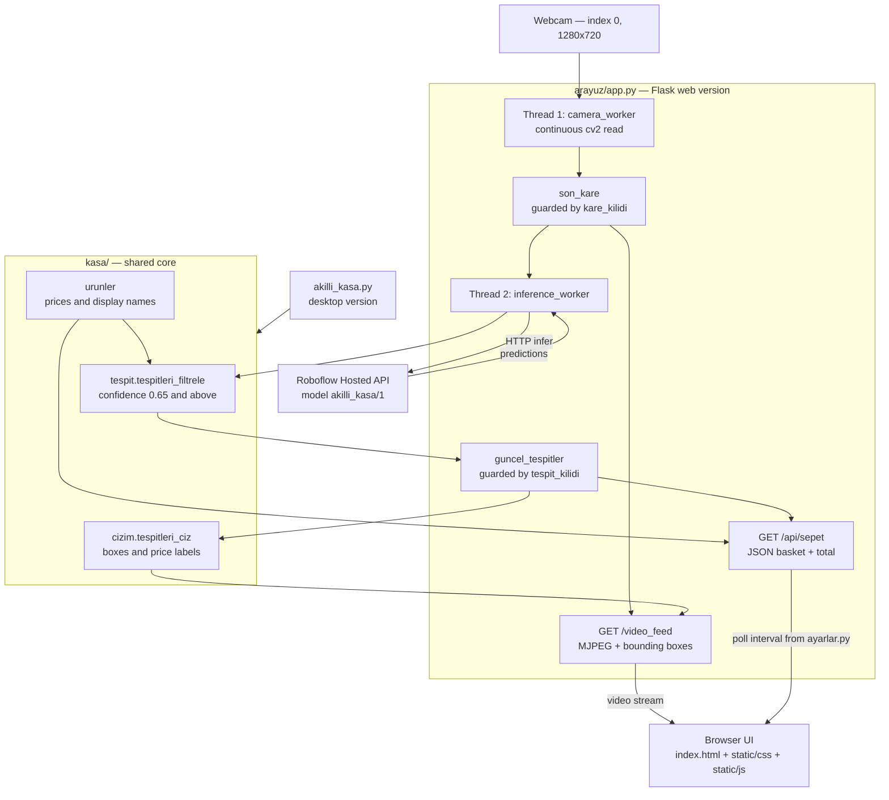
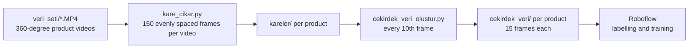

# Akıllı Kasa — Kasiyersiz Kasa Sistemi / Smart Checkout System

A cashier-less checkout prototype that recognises packaged retail products from a live
webcam feed and builds a running receipt in real time — without barcode scanning.

**The problem it addresses.** Supermarket checkout requires every item to be physically
oriented and scanned one at a time, which is the main source of queue time. This project
replaces that step: the customer places products in the camera's view, and an object
detection model identifies them, counts duplicates and totals the basket continuously.

> **Status:** working prototype. Detection runs against a hosted Roboflow model, so an
> internet connection is required. See [Roadmap](#roadmap--yol-haritası).

---

## Özellikler / Features

- **Real-time detection** of 9 packaged product classes from a live camera feed.
- **Duplicate counting** — three identical wafers are boxed individually and billed as 3 units.
- **Confidence filtering** — detections below 0.65 confidence, and any class outside the
  price list, are discarded before they reach the receipt. The threshold and every other
  tunable value live in `kasa/ayarlar.py`.
- **Non-blocking threaded architecture** — camera capture and model inference run on
  separate threads, so network latency on the inference call never freezes the video feed.
- **MJPEG live stream** with bounding boxes and per-item price labels drawn server-side.
- **Dark-mode receipt UI** — polls the basket API every 500 ms and diffs the response, so
  the DOM is only rewritten when the basket actually changes. The interval is set once on
  the server and passed to the page, so the two sides cannot drift apart.
- **Single shared core** — the `kasa/` package holds prices, filtering and drawing, so the
  web and desktop versions cannot diverge in behaviour.
- **Dataset tooling included** — scripts to turn product videos into a labelling set.

### Recognised products / Tanınan ürünler

| Class | Product | Price (TL) |
|---|---|---|
| `biscolata_stix` | Biscolata Stix | 15.50 |
| `burcak_cikolatali` | Burçak Çikolatalı | 18.00 |
| `crax_aci` | Crax Acı Biber | 9.00 |
| `crax_lime` | Crax Lime | 9.00 |
| `dido` | Dido | 12.00 |
| `lipton_seftali` | Lipton Şeftali | 20.00 |
| `nescafe_vanilya` | Nescafe Vanilya | 25.00 |
| `patos_rolls` | Patos Rolls | 22.50 |
| `ulker_gofret` | Ülker Gofret | 10.00 |

Prices (`FIYATLAR`) and display names (`URUN_ISIMLERI`) are defined in `kasa/urunler.py`
and shared by both entry points. `FIYATLAR` doubles as the whitelist: a detected class
that has no price is discarded.

---

## Teknolojiler / Tech Stack

| Layer | Technology | Purpose |
|---|---|---|
| Backend | Python 3 | Application language |
| Web server | Flask | Serves the UI, MJPEG stream and JSON basket API |
| Shared core | `kasa/` package | Prices, filtering and drawing used by both entry points |
| Vision | OpenCV (`opencv-python`) | Camera capture, frame drawing, JPEG encoding |
| Inference | Roboflow `inference-sdk` | Hosted object detection (`akilli_kasa/1`) |
| Config | `python-dotenv` | Reads credentials from `.env` |
| Frontend | HTML + CSS + vanilla JS | Separate static files, no framework and no build step |
| Dataset tools | OpenCV + Python stdlib | Video to frames, frame sampling |

### Gereksinimler / Requirements

This is a software-only project — there is no microcontroller or custom hardware. The
physical and external components it depends on are:

| Component | Requirement | Notes |
|---|---|---|
| Camera | Any USB or built-in webcam | Opened at index `0`, requested at 1280×720 |
| Display | Any | Only the desktop variant `akilli_kasa.py` opens an OpenCV window |
| Network | **Internet connection required** | Inference is *not* local; frames are sent to Roboflow's hosted API |
| Account | Roboflow account + API key | Free tier is sufficient for the hosted model |

---

## Mimari / Architecture

Two background threads decouple camera capture from inference. The camera thread keeps
`son_kare` fresh at full speed; the inference thread samples whatever the newest frame
is and updates `guncel_tespitler` independently. Flask request threads read both under
locks. This is why a slow API round-trip degrades detection freshness but never the video.



The desktop version (`akilli_kasa.py`) reuses the same core, so the two variants cannot
drift apart on prices, threshold or box styling.

Dataset preparation is a separate, offline pipeline:



---

## Kurulum ve Çalıştırma / Installation and Usage

### 1. Clone the repository

```bash
git clone https://github.com/Keremglc7/Akilli-Kasa.git
cd Akilli-Kasa
```

### 2. Create a virtual environment

```bash
python -m venv .venv
```

Activate it:

```powershell
# Windows (PowerShell)
.venv\Scripts\Activate.ps1
```

```bash
# macOS / Linux
source .venv/bin/activate
```

### 3. Install dependencies

```bash
pip install -r requirements.txt
```

### 4. Configure credentials

Copy the example environment file:

```bash
# macOS / Linux
cp .env.example .env
```

```powershell
# Windows
copy .env.example .env
```

Then edit `.env` and add your own Roboflow API key:

```ini
ROBOFLOW_API_KEY=your_api_key_here
ROBOFLOW_MODEL_ID=akilli_kasa/1
KASA_HOST=127.0.0.1
KASA_PORT=5000
```

Get a key from [app.roboflow.com](https://app.roboflow.com) under Settings → API Keys.
The application exits with an explicit error message if `ROBOFLOW_API_KEY` is unset.

> `.env` is listed in `.gitignore` and must never be committed.

### 5. Run

```bash
python baslat.py
```

This starts the Flask server and opens `http://127.0.0.1:5000` in your default browser.

#### Entry points / Giriş noktaları

| Command | What it does |
|---|---|
| `python baslat.py` | **Recommended.** Starts the server and opens the browser. |
| `python arayuz/app.py` | Starts the web server only, without opening a browser. |
| `python akilli_kasa.py` | Standalone desktop version in an OpenCV window. Press `q` to quit. |

By default the server binds to `127.0.0.1`, so it is reachable only from the machine it
runs on. The `/video_feed` endpoint exposes the raw camera stream and has **no
authentication**, so only set `KASA_HOST` to `0.0.0.0` if you accept that this makes the
camera feed viewable by anyone on your network.

---

## Veri Seti / Dataset Pipeline

The raw videos (`veri_seti/`, ~222 MB) and the extracted frames (`kareler/`, ~133 MB) are
**not tracked in git** — they are large and fully reproducible. A small labelling sample is
kept in `cekirdek_veri/` so the dataset format is visible without a separate download.

To rebuild the dataset from your own product videos:

```bash
# 1. Put one short 360-degree video per product in veri_seti/
#    The filename becomes the class name: veri_seti/dido.MP4 -> class "dido"

# 2. Extract 150 evenly spaced frames per video into kareler/
python kare_cikar.py

# 3. Sample every 10th frame into cekirdek_veri/ as the labelling set
python cekirdek_veri_olustur.py
```

Frames are labelled in **original colour**. An earlier greyscale approach caused a
"colour blindness" failure in which identically shaped black and white packages were
confused with each other.

---

## Ekran Görüntüleri / Screenshots

> Screenshots and the demo video are not added yet. Place the files under `docs/` and the
> links below will resolve.

**Live checkout interface**

<!-- Buraya ekleyin: docs/ekran-goruntusu-arayuz.png -->


**Detection in progress**

<!-- Buraya ekleyin: docs/ekran-goruntusu-tespit.png -->


**Demo video**

<!-- Buraya ekleyin: docs/demo.gif veya bir YouTube linki -->


---

## Klasör Yapısı / Project Structure

```
Akilli-Kasa/
├── baslat.py                     # One-click launcher: starts server, opens browser
├── akilli_kasa.py                # Standalone desktop version (OpenCV window)
├── kare_cikar.py                 # Dataset tool: video -> 150 frames per product
├── cekirdek_veri_olustur.py      # Dataset tool: every 10th frame -> labelling set
├── requirements.txt
├── .env.example                  # Template for .env (copy and fill in)
├── .gitignore
├── LICENSE
├── README.md
│
├── kasa/                         # Shared core, used by both entry points
│   ├── __init__.py
│   ├── ayarlar.py                # .env loading and all configuration constants
│   ├── urunler.py                # Product prices and display names
│   ├── tespit.py                 # Roboflow client and prediction filtering
│   ├── cizim.py                  # Bounding boxes, labels, basket total overlay
│   └── araclar.py                # Logging setup and console banner
│
├── arayuz/                       # Web interface
│   ├── app.py                    # Flask backend: threads, MJPEG stream, basket API
│   ├── templates/
│   │   └── index.html            # Page markup
│   └── static/
│       ├── css/kasa.css          # Dark-mode styles
│       └── js/kasa.js            # Basket polling and receipt rendering
│
├── cekirdek_veri/                # Labelling sample, 15 frames per product (tracked)
│
├── modeller/                     # Local model weights (currently empty, see Roadmap)
│
├── veri_seti/                    # Raw product videos   — NOT in git (.gitignore)
└── kareler/                      # Extracted frames     — NOT in git (.gitignore)
```

Both entry points share the same detection pipeline through `kasa/`, so prices, the
confidence threshold and the drawing style are defined in exactly one place.

### HTTP endpoints

| Route | Response | Description |
|---|---|---|
| `/` | HTML | The checkout interface |
| `/video_feed` | `multipart/x-mixed-replace` | MJPEG stream with detection boxes |
| `/api/sepet` | JSON | Current basket: items, unit prices, quantities, total |

---

## Roadmap / Yol Haritası

- [x] **Module A — Dataset generation.** Video capture, frame extraction, colour labelling.
- [x] **Module B — Model training.** Trained on Roboflow as `akilli_kasa/1`.
- [x] **Module C — Live detection.** Threaded capture and inference, duplicate counting.
- [x] **Module D — Pricing and interface.** Price matching and the digital receipt UI.
- [ ] **Local inference.** The model currently runs on Roboflow's hosted API, which makes
      an internet connection mandatory and adds network latency to every detection.
      Exporting the weights into `modeller/` and running inference locally would remove
      both constraints. `modeller/` stays empty until then.
- [ ] **Persistent sales records.** The application is stateless; nothing is stored between runs.
- [ ] **Payment step.** The basket total is displayed, but there is no checkout or payment flow.

---

## Lisans / License

Released under the MIT License. See [LICENSE](LICENSE) for details.

## Yazar / Author

**Kerem Güleç**

- GitHub: [@Keremglc7](https://github.com/Keremglc7)
- Email: keremglc7@gmail.com
